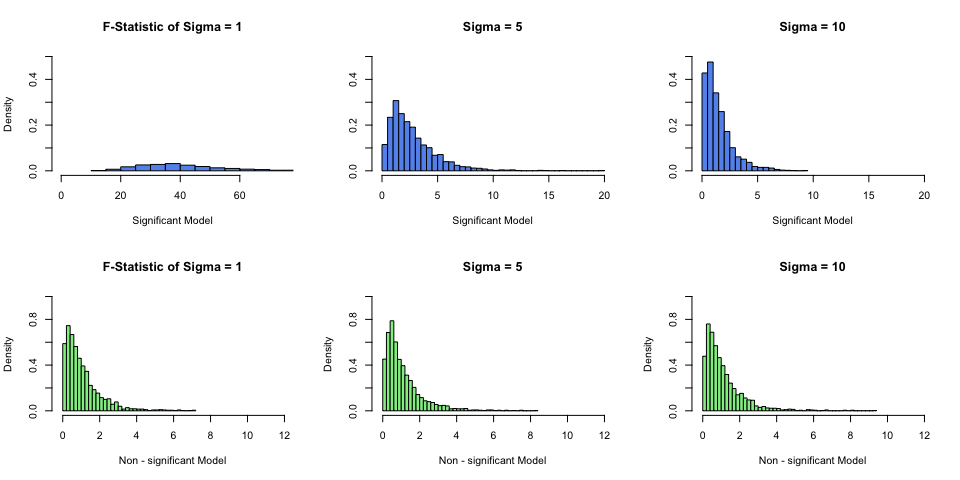
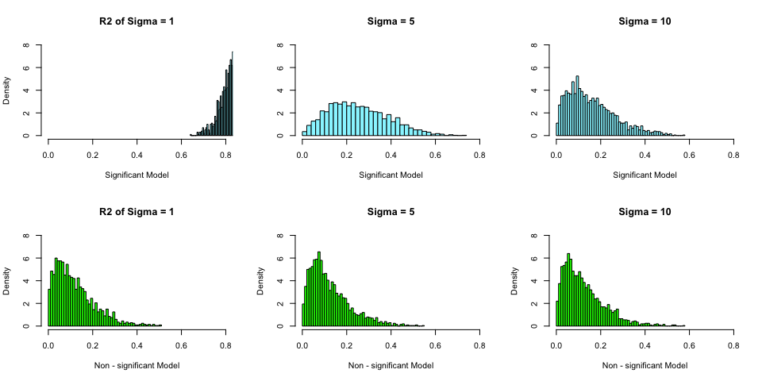
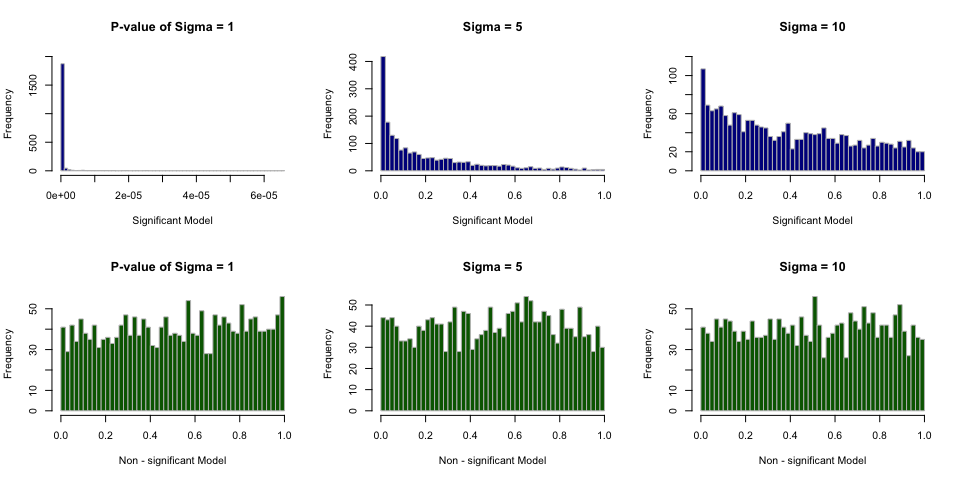
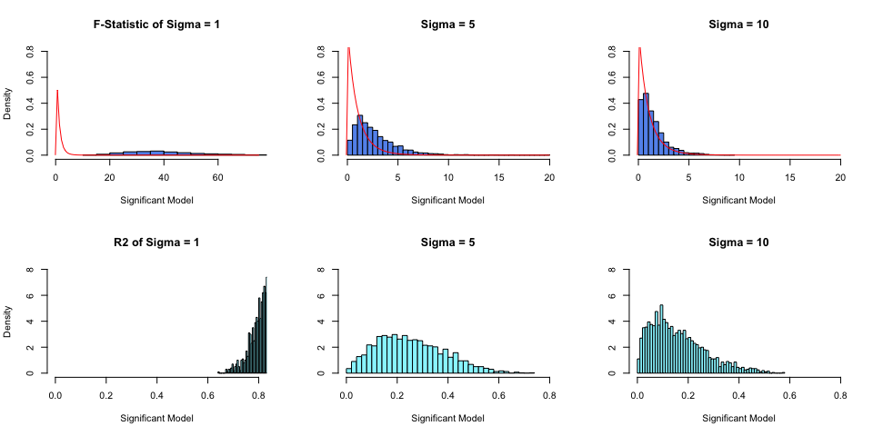
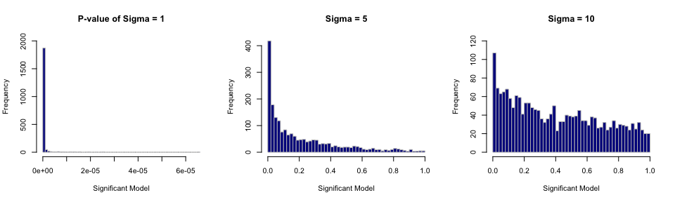
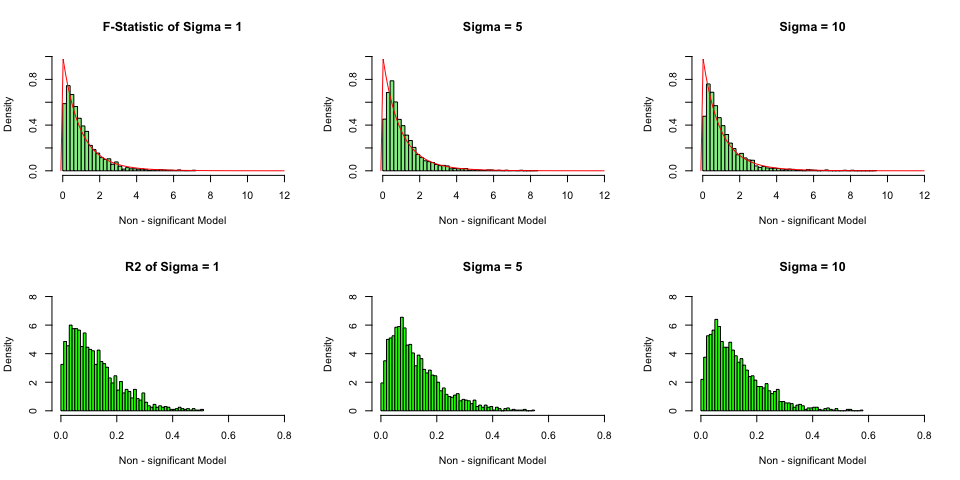
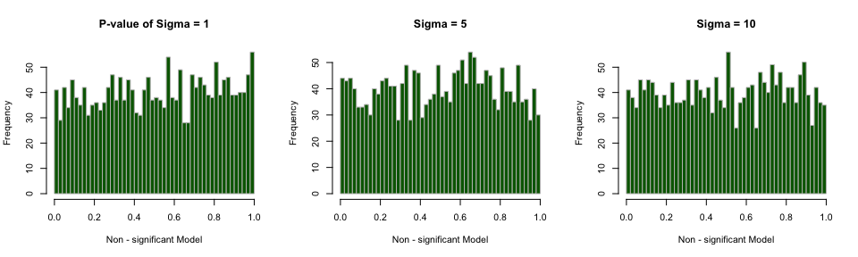

***


# Simulation Study 1: Significance of Regression

### Introduction

In this simulation study we will investigate the significance of regression test. We will simulate from two different models:

1. The **"significant"** model

\[
Y_i = \beta_0 + \beta_1 x_{i1} + \beta_2 x_{i2} + \beta_3 x_{i3} + \epsilon_i
\]

where $\epsilon_i \sim N(0, \sigma^2)$ and

- $\beta_0 = 3$,
- $\beta_1 = 1$,
- $\beta_2 = 1$,
- $\beta_3 = 1$.


2. The **"non-significant"** model

\[
Y_i = \beta_0 + \beta_1 x_{i1} + \beta_2 x_{i2} + \beta_3 x_{i3} + \epsilon_i
\]

where $\epsilon_i \sim N(0, \sigma^2)$ and

- $\beta_0 = 3$,
- $\beta_1 = 0$,
- $\beta_2 = 0$,
- $\beta_3 = 0$.

For both, we will consider a sample size of $25$ and three possible levels of noise. That is, three values of $\sigma$.

- $n = 25$
- $\sigma \in (1, 5, 10)$

Simulation will be used to obtain an empirical distribution for each of the following values, for each of the three values of $\sigma$, for both models.

- The **$F$ statistic** for the significance of regression test.
- The **p-value** for the significance of regression test
- **$R^2$**

### Methods

```r
# Seed
birthday = 19380301
set.seed(birthday)
```

Data found in [`study_1.csv`](study_1.csv) will be the values of the predictors. These will be kept constant for the entirety of this study. The `y` values in this data are a blank placeholder.


```r
# Load data source
library(readr)
study1 = read.csv('study_1.csv')
str(study1)
```

```
## 'data.frame':	25 obs. of  4 variables:
##  $ y : int  0 0 0 0 0 0 0 0 0 0 ...
##  $ x1: num  -1.54 -1.61 -4.56 -2.28 -2.76 -3.01 0.69 -3.31 -3.53 -4.12 ...
##  $ x2: num  3 2.9 2.9 2.5 3 2.9 2.1 2.7 2.2 2.8 ...
##  $ x3: num  2.96 2.71 2.62 2.41 2.77 ...
```

```r
# GLobal variables
n = 25
p = 3
sigma = c(1, 5, 10)
x = study1

sim_cycle = 2000
```

For each model and $\sigma$ combination, there will be $2000$ simulations. For each simulation, we will fit a regression model of the same form used to perform the simulation.

The `y` vector $2 (models)×3 (sigmas)×2000 (sims)=12000$ will be simulated times.


```r
initialize_var = function(cycle){
  ph = rep(0,cycle)
  
  fstat_sig <<- data.frame(sigma_1 = ph, sigma_2 = ph, sigma_3 = ph)
  pvalue_sig <<-data.frame(sigma_1 = ph, sigma_2 = ph, sigma_3 = ph)
  R2_sig <<- data.frame(sigma_1 = ph, sigma_2 = ph, sigma_3 = ph)
  fstat_nsig <<- data.frame(sigma_1 = ph, sigma_2 = ph, sigma_3 = ph)
  pvalue_nsig <<- data.frame(sigma_1 = ph, sigma_2 = ph, sigma_3 = ph)
  R2_nsig <<- data.frame(sigma_1 = ph, sigma_2 = ph, sigma_3 = ph)
  
  p <<- 3
}

# Generate sim data
sim_mlr = function(x, sigma = 1, model = 'sig') {
  if (model == 'sig') {
    beta_0 = 3
    beta_1 = 1
    beta_2 = 1
    beta_3 = 1
  } else{
    beta_0 = 3
    beta_1 = 0
    beta_2 = 0
    beta_3 = 0
  }
  
  n = nrow(x)
  x = x[, -1] #remove 1st column(y value)
  ones = rep(1, n)
  X = as.matrix(cbind(ones, x))
  
  epsilon = rnorm(n, mean = 0, sd = sigma)
  B = rbind(beta_0, beta_1, beta_2, beta_3)
  Y = X %*% B + epsilon
  data.frame(y = Y, predictor = x
  )
}
```

#### F-test is used to test the significance of the regression.

- The null and alternative hypotheses
  - $H_0: \beta_1 = \beta_2 = \beta_3 = 0$
  - $H_1:$ At Least one of $\beta_j \neq 0,j=1,2,3$
  

```r
# Simulation
simulate = function(x) {
  for (i in 1:3) { # 3 sigmas
    for (j in 1:sim_cycle) {
      sim_data = sim_mlr(x, sigma[i], 'sig')
      model = lm(y ~ ., sim_data)
      #fstat_sig[[i]][j] = summary(model)$f[1]
      fstat_sig[j, i] <<- summary(model)$f[1]
      pvalue_sig[j, i] <<-
        pf(
          summary(model)$f[1],
          df1 = summary(model)$f[2],
          df2 = summary(model)$f[3],
          lower.tail = FALSE
        )
      R2_sig[j, i] <<- summary(model)$r.squared
      
      sim_data = sim_mlr(x, sigma[i], 'nsig')
      model = lm(y ~ ., sim_data)
      fstat_nsig[j, i] <<- summary(model)$f[1]
      pvalue_nsig[j, i] <<-
        pf(
          summary(model)$f[1],
          df1 = summary(model)$f[2],
          df2 = summary(model)$f[3],
          lower.tail = FALSE
        )
      R2_nsig[j, i] <<- summary(model)$r.squared
    } #sim_cycle
  } #sigma
}
```

- Simulation results will be plotted by below functions


```r
# F-statistics Histogram
fstat_hist = function(df1, df2, sig=FALSE, nsig=FALSE, curve=FALSE){
  
  # set height of histogram for true distribution curve
  t_ylim = ifelse(curve == FALSE, 0.5, 0.8) 
  
  if(sig==TRUE){
    hist(fstat_sig[[1]], freq=FALSE, breaks='Scott', ylim=c(0,t_ylim), xlim=c(-0.1,75),
         main='F-Statistic of Sigma = 1', xlab='Significant Model', col='cornflowerblue')
    if (curve==TRUE){curve(df(x, df1=df1, df2=df2), col='red', add=TRUE)}
    hist(fstat_sig[[2]], freq=FALSE, breaks='Scott', ylim=c(0,t_ylim), xlim=c(-0.1,20),
         main='Sigma = 5', xlab='Significant Model', ylab='', col='cornflowerblue')
    if (curve==TRUE){curve(df(x, df1=df1, df2=df2), col='red', add=TRUE)}
    hist(fstat_sig[[3]], freq=FALSE, breaks='Scott', ylim=c(0,t_ylim), xlim=c(-0.1,20),
         main='Sigma = 10', xlab='Significant Model', ylab='', col='cornflowerblue')
    if (curve==TRUE){curve(df(x, df1=df1, df2=df2), col='red', add=TRUE)}
  }
  
  if(nsig==TRUE){
    hist(fstat_nsig[[1]], freq=FALSE, breaks=50, xlim=c(-0.1,12), ylim=c(0,1),
         main='F-Statistic of Sigma = 1', xlab='Non - significant Model', col='lightgreen')
    if (curve==TRUE){curve(df(x, df1=df1, df2=df2), col='red', add=TRUE)}
    hist(fstat_nsig[[2]], freq=FALSE, breaks=50, xlim=c(-0.1,12), ylim=c(0,1),
         main='Sigma = 5', xlab='Non - significant Model', col='lightgreen')
    if (curve==TRUE){curve(df(x, df1=df1, df2=df2), col='red', add=TRUE)}
    hist(fstat_nsig[[3]], freq=FALSE, breaks=50, xlim=c(-0.1,12), ylim=c(0,1),
         main='Sigma = 10', xlab='Non - significant Model', col='lightgreen')
    if (curve==TRUE){curve(df(x, df1=df1, df2=df2), col='red', add=TRUE)}
  }
}

# R2 Histogram
R2_hist = function(df1, df2, sig=FALSE, nsig=FALSE){
  
  if(sig==TRUE){
    hist(R2_sig[[1]], freq=FALSE, breaks=50, xlim = (c(0,0.8)), ylim=c(0,8),
         main='R2 of Sigma = 1', xlab='Significant Model', col='cadetblue1')
    hist(R2_sig[[2]], freq=FALSE, breaks=50, xlim = (c(0,0.8)), ylim=c(0,8),
         main='Sigma = 5', xlab='Significant Model', ylab='', col='cadetblue1')
    hist(R2_sig[[3]], freq=FALSE, breaks=50, xlim = (c(0,0.8)), ylim=c(0,8),
         main='Sigma = 10', xlab='Significant Model', ylab='', col='cadetblue1')
  }
  
  if(nsig==TRUE){
    hist(R2_nsig[[1]], freq = FALSE, breaks = 50, xlim = (c(0, 0.8)), ylim = c(0, 8),
         main = 'R2 of Sigma = 1', xlab = 'Non - significant Model', col = 'green')
    hist(R2_nsig[[2]], freq = FALSE, breaks = 50, xlim = (c(0, 0.8)), ylim = c(0, 8),
         main = 'Sigma = 5', xlab = 'Non - significant Model', col = 'green')
    hist(R2_nsig[[3]], freq = FALSE, breaks = 50, xlim = (c(0, 0.8)), ylim = c(0, 8),
         main = 'Sigma = 10', xlab = 'Non - significant Model', col = 'green')
  }
}

# P-value Histogram
pvalue_hist = function(df1,df2, sig=FALSE, nsig=FALSE){
   if(sig==TRUE){
     hist(pvalue_sig[[1]], freq = TRUE, breaks = 50, ylim = c(0, 2000),
          main = 'P-value of Sigma = 1', xlab = 'Significant Model',
          col = 'darkblue', border = 'grey')
     hist(pvalue_sig[[2]], freq = TRUE, breaks = 50,
          main = 'Sigma = 5', xlab = 'Significant Model',
          col = 'darkblue', border = 'grey')
     hist(pvalue_sig[[3]], freq = TRUE, breaks = 50, ylim = c(0, 120),
          main = 'Sigma = 10', xlab = 'Significant Model', col = 'darkblue',
          border = 'grey')
   }
  
  if(nsig==TRUE){
    hist(pvalue_nsig[[1]], freq = TRUE, breaks = 50,
         main = 'P-value of Sigma = 1', xlab = 'Non - significant Model',
         col = 'darkgreen', border = 'grey')
    hist(pvalue_nsig[[2]], freq = TRUE, breaks = 50,
         main = 'Sigma = 5', xlab = 'Non - significant Model',
         col = 'darkgreen', border = 'grey')
    hist(pvalue_nsig[[3]], freq = TRUE, breaks = 50,
         main = 'Sigma = 10', xlab = 'Non - significant Model',
         col = 'darkgreen', border = 'grey')
  }
}


# Mean of Significant Model
mean_sig= function(){
  df = data.frame('.' = c('F-statistics', 'R2', 'P-value'), 
                  'Sigma=1' = c(mean(fstat_sig$sigma_1),
                                mean(R2_sig$sigma_1),
                                mean(pvalue_sig$sigma_1)), 
                  'Sigma=5' = c(mean(fstat_sig$sigma_2),
                                mean(R2_sig$sigma_2),
                                mean(pvalue_sig$sigma_2)), 
                  'Sigma=10' = c(mean(fstat_sig$sigma_3),
                                 mean(R2_sig$sigma_3),
                                 mean(pvalue_sig$sigma_3))
  )
  
  kable(df, 'markdown')
}

# Mean of Non-significant Model
mean_nsig = function(){
  df = data.frame('.' = c('F-statistics', 'R2', 'P-value'), 
                  'Sigma=1' = c(mean(fstat_nsig$sigma_1),
                                mean(R2_nsig$sigma_1),
                                mean(pvalue_nsig$sigma_1)),
                  'Sigma=5' = c(mean(fstat_nsig$sigma_2),
                                mean(R2_nsig$sigma_2),
                                mean(pvalue_nsig$sigma_2)),
                  'Sigma=10' = c(mean(fstat_nsig$sigma_3),
                                 mean(R2_nsig$sigma_3),
                                 mean(pvalue_nsig$sigma_3))
  )
  kable(df, 'markdown')
}
```

### Results

```r
#main
initialize_var(sim_cycle) #set no. of simulation cycle 2000
simulate(x) #simulate x
```


```r
df1 = p - 1 #p-1
df2 = n - p #n-p

par(mfrow = c(2, 3))
fstat_hist(df1, df2, TRUE, TRUE)
```

<!-- -->


```r
par(mfrow = c(2, 3))
R2_hist(df1, df2, TRUE, TRUE)
```

<!-- -->


```r
par(mfrow = c(2, 3))
pvalue_hist(df1, df2, TRUE, TRUE)
```

<!-- -->

### Discussion

- $H_0: \beta_1 = \beta_2 = \beta_3 = 0$
- $H_1:$ At Least one of $\beta_j \neq 0,j=1,2,3$
  
#### F-Statistics
- Since know the true distribution of F-statistics with two of the degress of freedom, it has been plotted with the empirical value in the F-statistics grid of plots in coming discussion.
- F-statistics has a distribution under null hypothesis. It means that assuming null hypothesis is true, the test statistics follows an F-distribution.

#### Significant Model
Since F-statistics has the above assumption, the empirical value of **"significant"** model does not follow the true distribution.

##### $\sigma$=1
  -  We can see in the plot on the left below, most of the F-value fall in the range from 20 to 50, which are considered as some very large F values. Such large F value corresponds to a very small p-value, that is to reject the null hypothesis.
  - When we look at the plot of $R^2$ for $\sigma$=1, majority of value falls above 0.7. It means the althernative hypothesis model is explaining well by the predictors on the relationship with the response. It is also a indicator for the decision to reject $H_0$.
  - The average F-statistics, $R^2$ and p-value are listed for each $\sigma$.
  

```r
par(mfrow = c(2, 3))
fstat_hist(df1, df2, sig = TRUE, curve = TRUE)
R2_hist(df1, df2, sig = TRUE)
```

<!-- -->

```r
# Significant Model
mean_sig() # mean values of F-statistics, R2 and P-value
```


|.            | Sigma.1| Sigma.5| Sigma.10|
|:------------|-------:|-------:|--------:|
|F-statistics | 41.4048|  2.7377|   1.4859|
|R2           |  0.8402|  0.2535|   0.1591|
|P-value      |  0.0000|  0.2090|   0.4054|

##### $\sigma$=5 and $\sigma$=10
  - In the above plots of F-value for the other two $\sigma$(s), the empirical values lean to the left of the graph, which represents majority of the F-value are small. It also means the corresponding p-value becomes larger.
  - In the plots of $R^2$, majority of values fall in the range of 0.1 to 0.3 for $\sigma$=5, 0.05 to 0.15 for $\sigma$=10. The model with these $\sigma$ do not performe well in explaining the relatinoship.
  - With sufficiently larger p-value, the chance of FTR $H_0$ will be much higher than that with $\sigma$=1.
  - They partially align with the characteristic of F-distribution. Nonetheless, even the empirical values becomes closer to the true value, it is still far from it. We will see how it goes with **"Non-significant "** model in the next section.

##### P-value distribution
P-value distribution of 3 $\sigma$ varies. 

  - In the first plots with $\sigma$ = 1, as discussed above, it comes with a critically small p-value so the decision is to reject the null hypothesis. The peak close to zero as shown in the plot is where the alternative hypothesis located.

```r
par(mfrow = c(1, 3))
pvalue_hist(df1, df2, TRUE)
```

<!-- -->

  - In the second plot with $\sigma$ = 5. More p-value is falling into larger values, which contribute to null hypothesis. The frequency of the value close to zero is lower comparing to the 1st plot. 
  - We should be reminded that null hypothesis contains low p-value as well.
  - In the thrid plot with $\sigma$ = 10. Even p-value is falling into larger values, we can see a close to uniform distribution when $p-value > 0.2$. For p-value < 0.1, frequency from 0 to 40 might contain null hypothesis as well.
  - The interpretation of p-value aligns with our previous explaination that the chance of FTR $H_0$ will be much higher.
 
#### Non-Significant Model


```r
par(mfrow = c(2, 3))
fstat_hist(df1, df2, nsig = TRUE, curve = TRUE)
R2_hist(df1, df2, nsig = TRUE)
```

<!-- -->

```r
# Non - Significant Model
mean_nsig() # mean values of F-statistics, R2 and P-value
```


|.            | Sigma.1| Sigma.5| Sigma.10|
|:------------|-------:|-------:|--------:|
|F-statistics |  1.0604|  1.1039|   1.1077|
|R2           |  0.1205|  0.1248|   0.1249|
|P-value      |  0.5159|  0.5011|   0.5019|

##### Close to True F-distribution
- As shown from the plots above, the F-value distribution of all $\sigma$ are critically close to the true F-distribution.
- The average F values are rougly between 1.1 and 1.2, which is considered very small comparning to the significant model.
- The average $R^2$ of all $\sigma$(s) are very small. It implies the **"non-significant"** model is not performing well in explaining the relationship between the predictors and reponse.
- The average P-value of all $\sigma$(s) are considered very large as they are close to 0.5.It alignes with the small F-values. Therefore, the decision is very likely to be FTR the null hypothesis.
- Hence, the very similar behaviour between the true F-distrbution and the **"non-significant"** model could be explained by the above findings.
- We can also interpret the result by looking at setting of $\beta_{\texttt{1-3}}$. As they are all zero, so we expect the $H_0$ is very likely to be true.

##### P-value distribution

P-value distribution of 3 $\sigma$ are very similar.

- The P-value follow a uniform distribution in all three plots.


```r
par(mfrow = c(1, 3))
pvalue_hist(df1, df2, nsig = TRUE)
```

<!-- -->

- It means that 5% of the p-value will be above the 9th percentile, another 5% will be between 90th and 95th percentile, and so forth. 5% of the value will be from 0 to 0.05, and another will be from 0.05 to 0.1.
- The uniformly distributed p-value is one of the definition of a p-value under null hypothesis.
- The above observation aligns with our discussed devision to be FTR $H_0$.

#### **$\sigma$** vs F-statistic, p-value, R2

We will look into the relatinoship between $\sigma$, and $F$ statistic, the p-value, $R^2$.

- When we perform a significant test on regression, the relationship varies differently according to the settings of the model. Specifically, the relationship is affected by the value of $\beta$.

In **"Significant"** model, we have positive signal strength for $\beta_{\texttt{1-3}}$. 

- When $\sigma$ becomes larger, the F-statistic distribution becomes closer to the true F-distribution. The value of $R^2$ drops significantly and p-value increases significantly.
- We can interpret that, when $\sigma$ becomes larger in **"Signigficant"** model, it is more likely to be FTR $H_0$.

In **"Non-Significant"** model, we have zero signal strength for $\beta_{\texttt{1-3}}$ and $\beta_0$ = 3.

- When $\sigma$ varies, the effect on $F$ statistic, the p-value and $R^2$ are considerably small.
- Hence, given $\beta_0$ = 3, under the settings of **"Non-Significant"**, we can interpret that, $\sigma$ has very slight influcence on $F$ statistic, the p-value and $R^2$. The decision of FTR $H_0$ would remain unchanged.
