***


# Simulation Study 1: Significance of Regression

### Introduction

In this simulation study we will investigate the significance of regression test. We will simulate from two different models:

1. The **"significant"** model

\[
Y_i = \beta_0 + \beta_1 x_{i1} + \beta_2 x_{i2} + \beta_3 x_{i3} + \epsilon_i
\]

where $\epsilon_i \sim N(0, \sigma^2)$ and

- $\beta_0 = 3$,
- $\beta_1 = 1$,
- $\beta_2 = 1$,
- $\beta_3 = 1$.


2. The **"non-significant"** model

\[
Y_i = \beta_0 + \beta_1 x_{i1} + \beta_2 x_{i2} + \beta_3 x_{i3} + \epsilon_i
\]

where $\epsilon_i \sim N(0, \sigma^2)$ and

- $\beta_0 = 3$,
- $\beta_1 = 0$,
- $\beta_2 = 0$,
- $\beta_3 = 0$.

For both, we will consider a sample size of $25$ and three possible levels of noise. That is, three values of $\sigma$.

- $n = 25$
- $\sigma \in (1, 5, 10)$

Simulation will be used to obtain an empirical distribution for each of the following values, for each of the three values of $\sigma$, for both models.

- The **$F$ statistic** for the significance of regression test.
- The **p-value** for the significance of regression test
- **$R^2$**

### Methods

```r
# Seed
birthday = 19380301
set.seed(birthday)
```

Data found in [`study_1.csv`](study_1.csv) will be the values of the predictors. These will be kept constant for the entirety of this study. The `y` values in this data are a blank placeholder.


```r
# Load data source
library(readr)
study1 = read.csv('study_1.csv')
str(study1)
```

```
## 'data.frame':	25 obs. of  4 variables:
##  $ y : int  0 0 0 0 0 0 0 0 0 0 ...
##  $ x1: num  -1.54 -1.61 -4.56 -2.28 -2.76 -3.01 0.69 -3.31 -3.53 -4.12 ...
##  $ x2: num  3 2.9 2.9 2.5 3 2.9 2.1 2.7 2.2 2.8 ...
##  $ x3: num  2.96 2.71 2.62 2.41 2.77 ...
```

```r
# GLobal variables
n = 25
p = 3
sigma = c(1, 5, 10)
x = study1

sim_cycle = 2000
```

For each model and $\sigma$ combination, there will be $2000$ simulations. For each simulation, we will fit a regression model of the same form used to perform the simulation.

The `y` vector $2 (models)×3 (sigmas)×2000 (sims)=12000$ will be simulated times.


```r
initialize_var = function(cycle){
  ph = rep(0,cycle)
  
  fstat_sig <<- data.frame(sigma_1 = ph, sigma_2 = ph, sigma_3 = ph)
  pvalue_sig <<-data.frame(sigma_1 = ph, sigma_2 = ph, sigma_3 = ph)
  R2_sig <<- data.frame(sigma_1 = ph, sigma_2 = ph, sigma_3 = ph)
  fstat_nsig <<- data.frame(sigma_1 = ph, sigma_2 = ph, sigma_3 = ph)
  pvalue_nsig <<- data.frame(sigma_1 = ph, sigma_2 = ph, sigma_3 = ph)
  R2_nsig <<- data.frame(sigma_1 = ph, sigma_2 = ph, sigma_3 = ph)
  
  p <<- 3
}

# Generate sim data
sim_mlr = function(x, sigma = 1, model = 'sig') {
  if (model == 'sig') {
    beta_0 = 3
    beta_1 = 1
    beta_2 = 1
    beta_3 = 1
  } else{
    beta_0 = 3
    beta_1 = 0
    beta_2 = 0
    beta_3 = 0
  }
  
  n = nrow(x)
  x = x[, -1] #remove 1st column(y value)
  ones = rep(1, n)
  X = as.matrix(cbind(ones, x))
  
  epsilon = rnorm(n, mean = 0, sd = sigma)
  B = rbind(beta_0, beta_1, beta_2, beta_3)
  Y = X %*% B + epsilon
  data.frame(y = Y, predictor = x
  )
}
```

#### F-test is used to test the significance of the regression.

- The null and alternative hypotheses
  - $H_0: \beta_1 = \beta_2 = \beta_3 = 0$
  - $H_1:$ At Least one of $\beta_j \neq 0,j=1,2,3$
  

```r
# Simulation
simulate = function(x) {
  for (i in 1:3) { # 3 sigmas
    for (j in 1:sim_cycle) {
      sim_data = sim_mlr(x, sigma[i], 'sig')
      model = lm(y ~ ., sim_data)
      #fstat_sig[[i]][j] = summary(model)$f[1]
      fstat_sig[j, i] <<- summary(model)$f[1]
      pvalue_sig[j, i] <<-
        pf(
          summary(model)$f[1],
          df1 = summary(model)$f[2],
          df2 = summary(model)$f[3],
          lower.tail = FALSE
        )
      R2_sig[j, i] <<- summary(model)$r.squared
      
      sim_data = sim_mlr(x, sigma[i], 'nsig')
      model = lm(y ~ ., sim_data)
      fstat_nsig[j, i] <<- summary(model)$f[1]
      pvalue_nsig[j, i] <<-
        pf(
          summary(model)$f[1],
          df1 = summary(model)$f[2],
          df2 = summary(model)$f[3],
          lower.tail = FALSE
        )
      R2_nsig[j, i] <<- summary(model)$r.squared
    } #sim_cycle
  } #sigma
}
```

- Simulation results will be plotted by below functions


```r
# F-statistics Histogram
fstat_hist = function(df1, df2, sig=FALSE, nsig=FALSE, curve=FALSE){
  
  # set height of histogram for true distribution curve
  t_ylim = ifelse(curve == FALSE, 0.5, 0.8) 
  
  if(sig==TRUE){
    hist(fstat_sig[[1]], freq=FALSE, breaks='Scott', ylim=c(0,t_ylim), xlim=c(-0.1,75),
         main='F-Statistic of Sigma = 1', xlab='Significant Model', col='cornflowerblue')
    if (curve==TRUE){curve(df(x, df1=df1, df2=df2), col='red', add=TRUE)}
    hist(fstat_sig[[2]], freq=FALSE, breaks='Scott', ylim=c(0,t_ylim), xlim=c(-0.1,20),
         main='Sigma = 5', xlab='Significant Model', ylab='', col='cornflowerblue')
    if (curve==TRUE){curve(df(x, df1=df1, df2=df2), col='red', add=TRUE)}
    hist(fstat_sig[[3]], freq=FALSE, breaks='Scott', ylim=c(0,t_ylim), xlim=c(-0.1,20),
         main='Sigma = 10', xlab='Significant Model', ylab='', col='cornflowerblue')
    if (curve==TRUE){curve(df(x, df1=df1, df2=df2), col='red', add=TRUE)}
  }
  
  if(nsig==TRUE){
    hist(fstat_nsig[[1]], freq=FALSE, breaks=50, xlim=c(-0.1,12), ylim=c(0,1),
         main='F-Statistic of Sigma = 1', xlab='Non - significant Model', col='lightgreen')
    if (curve==TRUE){curve(df(x, df1=df1, df2=df2), col='red', add=TRUE)}
    hist(fstat_nsig[[2]], freq=FALSE, breaks=50, xlim=c(-0.1,12), ylim=c(0,1),
         main='Sigma = 5', xlab='Non - significant Model', col='lightgreen')
    if (curve==TRUE){curve(df(x, df1=df1, df2=df2), col='red', add=TRUE)}
    hist(fstat_nsig[[3]], freq=FALSE, breaks=50, xlim=c(-0.1,12), ylim=c(0,1),
         main='Sigma = 10', xlab='Non - significant Model', col='lightgreen')
    if (curve==TRUE){curve(df(x, df1=df1, df2=df2), col='red', add=TRUE)}
  }
}

# R2 Histogram
R2_hist = function(df1, df2, sig=FALSE, nsig=FALSE){
  
  if(sig==TRUE){
    hist(R2_sig[[1]], freq=FALSE, breaks=50, xlim = (c(0,0.8)), ylim=c(0,8),
         main='R2 of Sigma = 1', xlab='Significant Model', col='cadetblue1')
    hist(R2_sig[[2]], freq=FALSE, breaks=50, xlim = (c(0,0.8)), ylim=c(0,8),
         main='Sigma = 5', xlab='Significant Model', ylab='', col='cadetblue1')
    hist(R2_sig[[3]], freq=FALSE, breaks=50, xlim = (c(0,0.8)), ylim=c(0,8),
         main='Sigma = 10', xlab='Significant Model', ylab='', col='cadetblue1')
  }
  
  if(nsig==TRUE){
    hist(R2_nsig[[1]], freq = FALSE, breaks = 50, xlim = (c(0, 0.8)), ylim = c(0, 8),
         main = 'R2 of Sigma = 1', xlab = 'Non - significant Model', col = 'green')
    hist(R2_nsig[[2]], freq = FALSE, breaks = 50, xlim = (c(0, 0.8)), ylim = c(0, 8),
         main = 'Sigma = 5', xlab = 'Non - significant Model', col = 'green')
    hist(R2_nsig[[3]], freq = FALSE, breaks = 50, xlim = (c(0, 0.8)), ylim = c(0, 8),
         main = 'Sigma = 10', xlab = 'Non - significant Model', col = 'green')
  }
}

# P-value Histogram
pvalue_hist = function(df1,df2, sig=FALSE, nsig=FALSE){
   if(sig==TRUE){
     hist(pvalue_sig[[1]], freq = TRUE, breaks = 50, ylim = c(0, 2000),
          main = 'P-value of Sigma = 1', xlab = 'Significant Model',
          col = 'darkblue', border = 'grey')
     hist(pvalue_sig[[2]], freq = TRUE, breaks = 50,
          main = 'Sigma = 5', xlab = 'Significant Model',
          col = 'darkblue', border = 'grey')
     hist(pvalue_sig[[3]], freq = TRUE, breaks = 50, ylim = c(0, 120),
          main = 'Sigma = 10', xlab = 'Significant Model', col = 'darkblue',
          border = 'grey')
   }
  
  if(nsig==TRUE){
    hist(pvalue_nsig[[1]], freq = TRUE, breaks = 50,
         main = 'P-value of Sigma = 1', xlab = 'Non - significant Model',
         col = 'darkgreen', border = 'grey')
    hist(pvalue_nsig[[2]], freq = TRUE, breaks = 50,
         main = 'Sigma = 5', xlab = 'Non - significant Model',
         col = 'darkgreen', border = 'grey')
    hist(pvalue_nsig[[3]], freq = TRUE, breaks = 50,
         main = 'Sigma = 10', xlab = 'Non - significant Model',
         col = 'darkgreen', border = 'grey')
  }
}


# Mean of Significant Model
mean_sig= function(){
  df = data.frame('.' = c('F-statistics', 'R2', 'P-value'), 
                  'Sigma=1' = c(mean(fstat_sig$sigma_1),
                                mean(R2_sig$sigma_1),
                                mean(pvalue_sig$sigma_1)), 
                  'Sigma=5' = c(mean(fstat_sig$sigma_2),
                                mean(R2_sig$sigma_2),
                                mean(pvalue_sig$sigma_2)), 
                  'Sigma=10' = c(mean(fstat_sig$sigma_3),
                                 mean(R2_sig$sigma_3),
                                 mean(pvalue_sig$sigma_3))
  )
  
  kable(df, 'markdown')
}

# Mean of Non-significant Model
mean_nsig = function(){
  df = data.frame('.' = c('F-statistics', 'R2', 'P-value'), 
                  'Sigma=1' = c(mean(fstat_nsig$sigma_1),
                                mean(R2_nsig$sigma_1),
                                mean(pvalue_nsig$sigma_1)),
                  'Sigma=5' = c(mean(fstat_nsig$sigma_2),
                                mean(R2_nsig$sigma_2),
                                mean(pvalue_nsig$sigma_2)),
                  'Sigma=10' = c(mean(fstat_nsig$sigma_3),
                                 mean(R2_nsig$sigma_3),
                                 mean(pvalue_nsig$sigma_3))
  )
  kable(df, 'markdown')
}
```

### Results

```r
#main
initialize_var(sim_cycle) #set no. of simulation cycle 2000
simulate(x) #simulate x
```


```r
df1 = p - 1 #p-1
df2 = n - p #n-p

par(mfrow = c(2, 3))
fstat_hist(df1, df2, TRUE, TRUE)
```

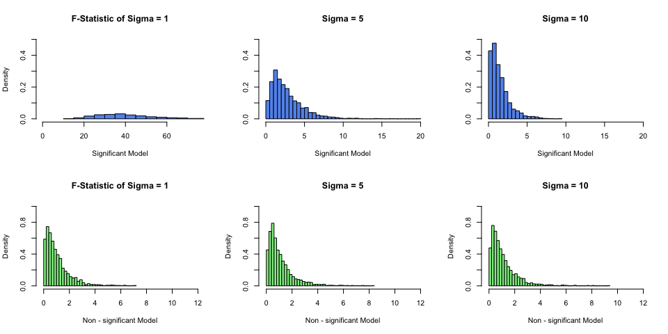<!-- -->


```r
par(mfrow = c(2, 3))
R2_hist(df1, df2, TRUE, TRUE)
```

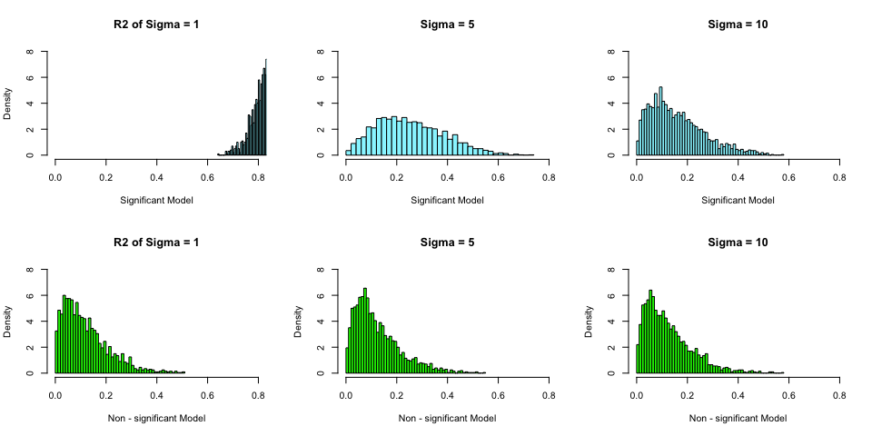<!-- -->


```r
par(mfrow = c(2, 3))
pvalue_hist(df1, df2, TRUE, TRUE)
```

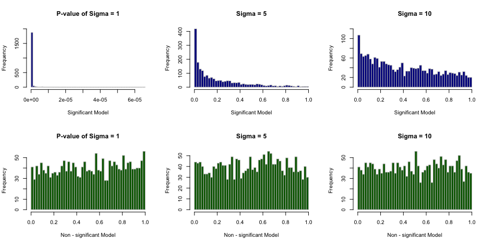<!-- -->

### Discussion

- $H_0: \beta_1 = \beta_2 = \beta_3 = 0$
- $H_1:$ At Least one of $\beta_j \neq 0,j=1,2,3$
  
#### F-Statistics
- Since know the true distribution of F-statistics with two of the degress of freedom, it has been plotted with the empirical value in the F-statistics grid of plots in coming discussion.
- F-statistics has a distribution under null hypothesis. It means that assuming null hypothesis is true, the test statistics follows an F-distribution.

#### Significant Model
Since F-statistics has the above assumption, the empirical value of **"significant"** model does not follow the true distribution.

##### $\sigma$=1
  -  We can see in the plot on the left below, most of the F-value fall in the range from 20 to 50, which are considered as some very large F values. Such large F value corresponds to a very small p-value, that is to reject the null hypothesis.
  - When we look at the plot of $R^2$ for $\sigma$=1, majority of value falls above 0.7. It means the althernative hypothesis model is explaining well by the predictors on the relationship with the response. It is also a indicator for the decision to reject $H_0$.
  - The average F-statistics, $R^2$ and p-value are listed for each $\sigma$.
  

```r
par(mfrow = c(2, 3))
fstat_hist(df1, df2, sig = TRUE, curve = TRUE)
R2_hist(df1, df2, sig = TRUE)
```

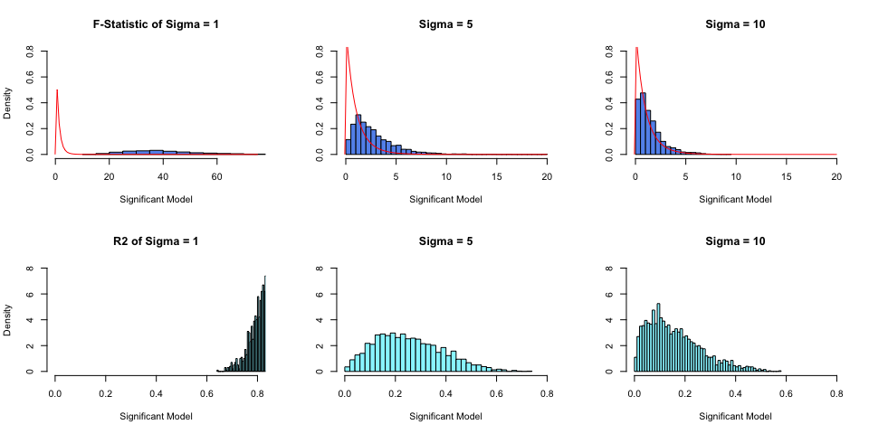<!-- -->

```r
# Significant Model
mean_sig() # mean values of F-statistics, R2 and P-value
```


|.            | Sigma.1| Sigma.5| Sigma.10|
|:------------|-------:|-------:|--------:|
|F-statistics | 41.4048|  2.7377|   1.4859|
|R2           |  0.8402|  0.2535|   0.1591|
|P-value      |  0.0000|  0.2090|   0.4054|

##### $\sigma$=5 and $\sigma$=10
  - In the above plots of F-value for the other two $\sigma$(s), the empirical values lean to the left of the graph, which represents majority of the F-value are small. It also means the corresponding p-value becomes larger.
  - In the plots of $R^2$, majority of values fall in the range of 0.1 to 0.3 for $\sigma$=5, 0.05 to 0.15 for $\sigma$=10. The model with these $\sigma$ do not performe well in explaining the relatinoship.
  - With sufficiently larger p-value, the chance of FTR $H_0$ will be much higher than that with $\sigma$=1.
  - They partially align with the characteristic of F-distribution. Nonetheless, even the empirical values becomes closer to the true value, it is still far from it. We will see how it goes with **"Non-significant "** model in the next section.

##### P-value distribution
P-value distribution of 3 $\sigma$ varies. 

  - In the first plots with $\sigma$ = 1, as discussed above, it comes with a critically small p-value so the decision is to reject the null hypothesis. The peak close to zero as shown in the plot is where the alternative hypothesis located.

```r
par(mfrow = c(1, 3))
pvalue_hist(df1, df2, TRUE)
```

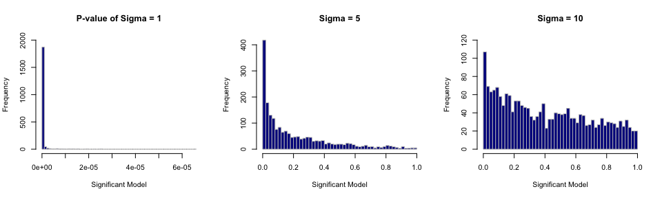<!-- -->

  - In the second plot with $\sigma$ = 5. More p-value is falling into larger values, which contribute to null hypothesis. The frequency of the value close to zero is lower comparing to the 1st plot. 
  - We should be reminded that null hypothesis contains low p-value as well.
  - In the thrid plot with $\sigma$ = 10. Even p-value is falling into larger values, we can see a close to uniform distribution when $p-value > 0.2$. For p-value < 0.1, frequency from 0 to 40 might contain null hypothesis as well.
  - The interpretation of p-value aligns with our previous explaination that the chance of FTR $H_0$ will be much higher.
 
#### Non-Significant Model


```r
par(mfrow = c(2, 3))
fstat_hist(df1, df2, nsig = TRUE, curve = TRUE)
R2_hist(df1, df2, nsig = TRUE)
```

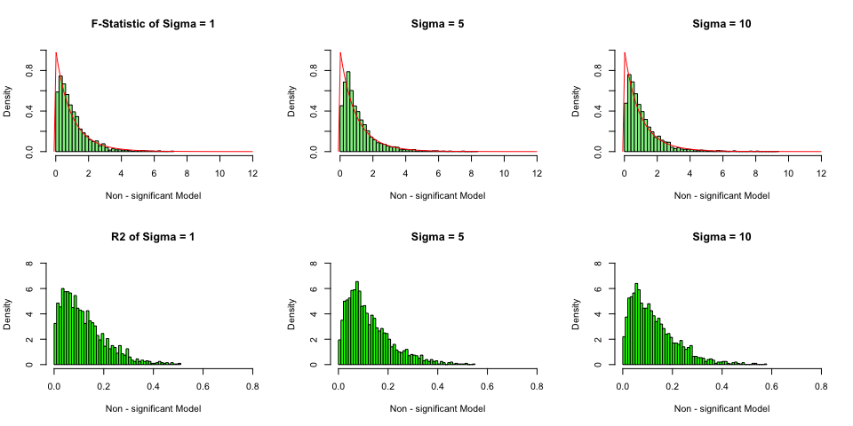<!-- -->

```r
# Non - Significant Model
mean_nsig() # mean values of F-statistics, R2 and P-value
```


|.            | Sigma.1| Sigma.5| Sigma.10|
|:------------|-------:|-------:|--------:|
|F-statistics |  1.0604|  1.1039|   1.1077|
|R2           |  0.1205|  0.1248|   0.1249|
|P-value      |  0.5159|  0.5011|   0.5019|

##### Close to True F-distribution
- As shown from the plots above, the F-value distribution of all $\sigma$ are critically close to the true F-distribution.
- The average F values are rougly between 1.1 and 1.2, which is considered very small comparning to the significant model.
- The average $R^2$ of all $\sigma$(s) are very small. It implies the **"non-significant"** model is not performing well in explaining the relationship between the predictors and reponse.
- The average P-value of all $\sigma$(s) are considered very large as they are close to 0.5.It alignes with the small F-values. Therefore, the decision is very likely to be FTR the null hypothesis.
- Hence, the very similar behaviour between the true F-distrbution and the **"non-significant"** model could be explained by the above findings.
- We can also interpret the result by looking at setting of $\beta_{\texttt{1-3}}$. As they are all zero, so we expect the $H_0$ is very likely to be true.

##### P-value distribution

P-value distribution of 3 $\sigma$ are very similar.

- The P-value follow a uniform distribution in all three plots.


```r
par(mfrow = c(1, 3))
pvalue_hist(df1, df2, nsig = TRUE)
```

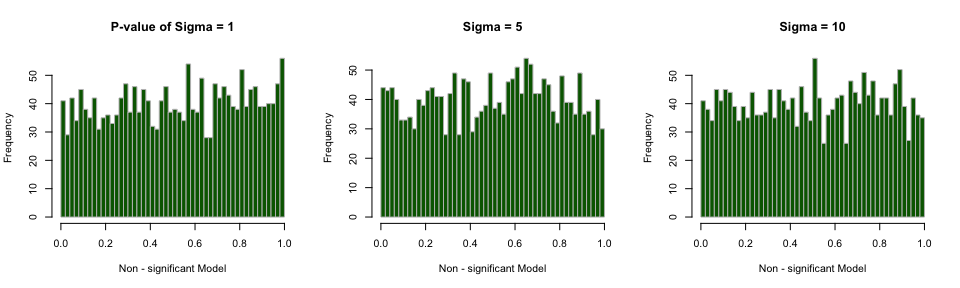<!-- -->

- It means that 5% of the p-value will be above the 9th percentile, another 5% will be between 90th and 95th percentile, and so forth. 5% of the value will be from 0 to 0.05, and another will be from 0.05 to 0.1.
- The uniformly distributed p-value is one of the definition of a p-value under null hypothesis.
- The above observation aligns with our discussed devision to be FTR $H_0$.

#### **$\sigma$** vs F-statistic, p-value, R2

We will look into the relatinoship between $\sigma$, and $F$ statistic, the p-value, $R^2$.

- When we perform a significant test on regression, the relationship varies differently according to the settings of the model. Specifically, the relationship is affected by the value of $\beta$.

In **"Significant"** model, we have positive signal strength for $\beta_{\texttt{1-3}}$. 

- When $\sigma$ becomes larger, the F-statistic distribution becomes closer to the true F-distribution. The value of $R^2$ drops significantly and p-value increases significantly.
- We can interpret that, when $\sigma$ becomes larger in **"Signigficant"** model, it is more likely to be FTR $H_0$.

In **"Non-Significant"** model, we have zero signal strength for $\beta_{\texttt{1-3}}$ and $\beta_0$ = 3.

- When $\sigma$ varies, the effect on $F$ statistic, the p-value and $R^2$ are considerably small.
- Hence, given $\beta_0$ = 3, under the settings of **"Non-Significant"**, we can interpret that, $\sigma$ has very slight influcence on $F$ statistic, the p-value and $R^2$. The decision of FTR $H_0$ would remain unchanged.
 
# Simulation Study 2: Using RMSE for Selection?
### Introduction

In this simulation study we will investigate how well this procedure works. Since splitting the data is random, we don’t expect it to work correctly each time. We could get unlucky. But averaged over many attempts, we should expect it to select the appropriate model.

We will simulate from the model

\[
Y_i = \beta_0 + \beta_1 x_{i1} + \beta_2 x_{i2} + \beta_3 x_{i3} + \beta_4 x_{i4} + \beta_5 x_{i5} + \beta_6 x_{i6} + \epsilon_i
\]

where $\epsilon_i \sim N(0, \sigma^2)$ and

- $\beta_0 = 0$,
- $\beta_1 = 3$,
- $\beta_2 = -4$,
- $\beta_3 = 1.6$,
- $\beta_4 = -1.1$,
- $\beta_5 = 0.7$,
- $\beta_6 = 0.5$.

### Methods

```r
# Seed
set.seed(birthday)
```

Data in [`study_2.csv`](study_2.csv) will be the values of the predictors. These will be kept constant for the entirety of this study. The `y` values in this data are a blank placeholder.


```r
# Load Data source
library(readr)
study2 = read.csv('study_2.csv')
```

We will consider a sample size of $500$ and three possible levels of noise. That is, three values of $\sigma$.

- $n = 500$
- $\sigma \in (1, 2, 4)$


```r
# GLobal variables
n = 500
sigma = c(1, 2, 4)
s2 = study2
sim_cycle = 1000

# RMSE for each sigma
RMSE_train = data.frame(sig1 = rep(0, 9), sig2 = rep(0, 9), sig3 = rep(0, 9))
RMSE_test = data.frame(sig1 = rep(0, 9), sig2 = rep(0, 9), sig3 = rep(0, 9))

# Selected Model size
Model_select_trn = matrix(0, sim_cycle, 3)
Model_select_tst = matrix(0, sim_cycle, 3)
```


```r
initialize_var = function(cycle){
  sim_cycle <<- cycle
  RMSE_train <<- data.frame(sig1 = rep(0, 9), sig2 = rep(0, 9), sig3 = rep(0, 9))
  RMSE_test <<- data.frame(sig1 = rep(0, 9), sig2 = rep(0, 9), sig3 = rep(0, 9))
  Model_select_trn <<- matrix(0, sim_cycle, 3)
  Model_select_tst <<- matrix(0, sim_cycle, 3)
}

# Generate sim data
sim_mlr = function(x, sigma = 1) {

  beta_0 = 0
  beta_1 = 3
  beta_2 = -4
  beta_3 = 1.6
  beta_4 = -1.1
  beta_5 = 0.7
  beta_6 = 0.5
  beta_7 = 0
  beta_8 = 0
  beta_9 = 0
  
  n = nrow(x)
  ones = rep(1, n)
  X = as.matrix(cbind(ones, x[,-1]))
  
  epsilon = rnorm(n, mean = 0, sd = sigma)
  B = as.matrix(rbind(beta_0, beta_1, beta_2, beta_3, beta_4, 
                      beta_5, beta_6, beta_7, beta_8, beta_9))
  y_hat = X %*% B + epsilon
  
  data.frame(y = y_hat, x = x[, -1])
}

# RMSE
get_RMSE = function(actual, predicted) {
  sqrt(mean((actual - predicted) ^ 2))
}
```

Each time the data is simulated, they will be randomly split into train and test sets of equal sizes (250 observations for training, 250 observations for testing).

For each, we will fit **nine** models, with forms:

- `y ~ x1`
- `y ~ x1 + x2`
- `y ~ x1 + x2 + x3`
- `y ~ x1 + x2 + x3 + x4`
- `y ~ x1 + x2 + x3 + x4 + x5`
- `y ~ x1 + x2 + x3 + x4 + x5 + x6`, the correct form of the model as noted above
- `y ~ x1 + x2 + x3 + x4 + x5 + x6 + x7`
- `y ~ x1 + x2 + x3 + x4 + x5 + x6 + x7 + x8`
- `y ~ x1 + x2 + x3 + x4 + x5 + x6 + x7 + x8 + x9`

For each model, we will calculate Train and Test RMSE.

\[
\text{RMSE}(\text{model, data}) = \sqrt{\frac{1}{n} \sum_{i = 1}^{n}(y_i - \hat{y}_i)^2}
\]

- In each simluation, one out of nine models will be selected for each sigma.
- The one with lowest RMSE value in test set will be selected.

```r
# Simulation
simulate = function(x){
  
  RMSE_trn_tmp = matrix(0, 9, sim_cycle)
  RMSE_tst_tmp = matrix(0, 9, sim_cycle)
  
  for (i in 1:3) { # 3 sigmas
    for (j in 1:sim_cycle) {
      sim_data = sim_mlr(x, sigma[i])
      
      #split data set
      trn_idx = sample(1:nrow(sim_data), 250)
      trn_data = sim_data[trn_idx, ]
      test_data = sim_data[-trn_idx, ]
      
      # fit model
      model1 = lm(y ~ x.x1, trn_data)
      model2 = lm(y ~ x.x1 + x.x2, trn_data)
      model3 = lm(y ~ x.x1 + x.x2 + x.x3, trn_data)
      model4 = lm(y ~ x.x1 + x.x2 + x.x3 + x.x4, trn_data)
      model5 = lm(y ~ x.x1 + x.x2 + x.x3 + x.x4 + x.x5, trn_data)
      model6 = lm(y ~ x.x1 + x.x2 + x.x3 + x.x4 + x.x5 + x.x6, trn_data)
      model7 = lm(y ~ x.x1 + x.x2 + x.x3 + x.x4 + x.x5 + x.x6 + x.x7, trn_data)
      model8 = lm(y ~ x.x1 + x.x2 + x.x3 + x.x4 + x.x5 + x.x6 + x.x7 + x.x8 , trn_data)
      model9 = lm(y ~ x.x1 + x.x2 + x.x3 + x.x4 + x.x5 + x.x6 + x.x7 + x.x8 + x.x9, trn_data)
      
      # RMSE - train data
      RMSE_trn_tmp[1, j] = get_RMSE(trn_data$y, fitted(model1))
      RMSE_trn_tmp[2, j] = get_RMSE(trn_data$y, fitted(model2))
      RMSE_trn_tmp[3, j] = get_RMSE(trn_data$y, fitted(model3))
      RMSE_trn_tmp[4, j] = get_RMSE(trn_data$y, fitted(model4))
      RMSE_trn_tmp[5, j] = get_RMSE(trn_data$y, fitted(model5))
      RMSE_trn_tmp[6, j] = get_RMSE(trn_data$y, fitted(model6))
      RMSE_trn_tmp[7, j] = get_RMSE(trn_data$y, fitted(model7))
      RMSE_trn_tmp[8, j] = get_RMSE(trn_data$y, fitted(model8))
      RMSE_trn_tmp[9, j] = get_RMSE(trn_data$y, fitted(model9))
      
      # RMSE - test data
      RMSE_tst_tmp[1, j] = get_RMSE(test_data$y, predict(model1, test_data))
      RMSE_tst_tmp[2, j] = get_RMSE(test_data$y, predict(model2, test_data))
      RMSE_tst_tmp[3, j] = get_RMSE(test_data$y, predict(model3, test_data))
      RMSE_tst_tmp[4, j] = get_RMSE(test_data$y, predict(model4, test_data))
      RMSE_tst_tmp[5, j] = get_RMSE(test_data$y, predict(model5, test_data))
      RMSE_tst_tmp[6, j] = get_RMSE(test_data$y, predict(model6, test_data))
      RMSE_tst_tmp[7, j] = get_RMSE(test_data$y, predict(model7, test_data))
      RMSE_tst_tmp[8, j] = get_RMSE(test_data$y, predict(model8, test_data))
      RMSE_tst_tmp[9, j] = get_RMSE(test_data$y, predict(model9, test_data))
      
      Model_select_trn[j,i] <<- which.min(RMSE_trn_tmp[, j])
      Model_select_tst[j,i] <<- which.min(RMSE_tst_tmp[, j])
    }
    #complete 1 of 3 sigmas
    for (k in 1:9) {
      RMSE_train[k, i] <<- mean(RMSE_trn_tmp[k,])
      RMSE_test[k, i] <<- mean(RMSE_tst_tmp[k,])
    }
    RMSE_trn_tmp = matrix(0, 9, sim_cycle)
    RMSE_tst_tmp = matrix(0, 9, sim_cycle)
  }
  Model_num = seq(1:9)
  RMSE_train <<- cbind(Model_num, RMSE_train)
  RMSE_test <<- cbind(Model_num, RMSE_test)
}
```

This above process will be repeated with $1000$ simulations for each of the $3$ values of $\sigma$. For each value of $\sigma$, there will be a plot that shows how average Train RMSE and average Test RMSE changes as a function of model size. We can also tell number of times the model of each size was chosen for each value of $\sigma$.

We will simulate the $y$ vector $3×1000=3000$ times and fit $9×3×1000=27000$ models.

- Simulation results will be plotted by below functions


```r
# Plot average RMSE as a function of Model size
plot_RMSE = function(show_diverge = FALSE, select_model = -1){
  
  if (show_diverge == FALSE){
    ylim1 = c(0.5, 4.7)
    ylim2 = c(0.5, 4.7)
    ylim3 = c(0.5, 4.7)
  }else{
    ylim1 = c(0.5, 2.5)
    ylim2 = c(1.5, 3.5)
    ylim3 = c(3.5, 5)
  }
  
  par(mfrow=c(1,3))
  plot(sig1 ~ Model_num, RMSE_train, type = 'l', col = 'orange', 
       cex = 1, pch = 1, ylim = ylim1, main = 'Sigma = 1', 
       xlab = 'Model size', ylab = 'RMSE', lwd = 3)
  lines(sig1 ~ Model_num, RMSE_test, col = 'blue', lty = 3, lwd = 2)
  if (select_model > 0){abline(v = select_model, col = 'red', lty = 6, lwd = 2)}
  legend('topright',  c('Train', 'Test'), lty = c(1, 3), col = c('orange', 'blue'))
  
  plot(sig2 ~ Model_num, RMSE_train, type = 'l', col = 'orange', 
       cex = 1, pch = 1, ylim = ylim2,  main = 'Sigma = 2',
       xlab = 'Model size', ylab = 'RMSE', lwd = 3)
  lines(sig2 ~ Model_num, RMSE_test, col = 'blue', lty = 3, lwd = 2)
  if (select_model > 0){abline(v = select_model, col = 'red', lty = 6, lwd = 2)}
  legend('topright',  c('Train', 'Test'), lty = c(1, 3), col = c('orange', 'blue'))
  
  plot(sig3 ~ Model_num, RMSE_train, type = 'l', col = 'orange',
       cex = 1, pch = 1, ylim = ylim3,  main = 'Sigma = 4',
       xlab = 'Model size', ylab = 'RMSE', lwd = 3)
  lines(sig3 ~ Model_num, RMSE_test, col = 'blue', lty = 3, lwd = 2)
  if (select_model > 0){abline(v = select_model, col = 'red', lty = 6, lwd = 2)}
  legend('topright',  c('Train', 'Test'), lty = c(1, 3), col = c('orange', 'blue'))
}

# Print RMSE by sigma, model size and data set
print_by_sigma = function(){
  
  RMSE_sig1 = unname(cbind(RMSE_train$Model_num, RMSE_train$sig1, RMSE_test$sig1))
  RMSE_sig2 = unname(cbind(RMSE_train$sig2, RMSE_test$sig2))
  RMSE_sig3 = unname(cbind(RMSE_train$sig3, RMSE_test$sig3))

  df = data.frame(RMSE_sig1, RMSE_sig2, RMSE_sig3)
  colnames(df) = c('Model size', 
                   'Sigma.1.Train', 'Sigma.1.Test',
                   'Sigma.2.Train', 'Sigma.2.Test',
                   'Sigma.4.Train', 'Sigma.4.Test')

  kable(df, "markdown")
}

# Print selected Model size of each sigma
print_model_selected = function(portion=FALSE, correct_model = 6){
  
  sigma1 = table(factor(Model_select_tst[, 1], levels = 1:9))
  sigma2 = table(factor(Model_select_tst[, 2], levels = 1:9))
  sigma3 = table(factor(Model_select_tst[, 3], levels = 1:9))
  
  combine = rbind(sigma1, sigma2, sigma3)
  rownames(combine) = c('Sigma = 1', 'Sigma = 2', 'Sigma = 4')
  
  if (portion == FALSE){
    kable(combine, "markdown")
  }else{
    portion_sig1 = sigma1[correct_model] / sim_cycle
    portion_sig2 = sigma2[correct_model] / sim_cycle
    portion_sig3 = sigma3[correct_model] / sim_cycle
    
    portion = rbind(portion_sig1, portion_sig2, portion_sig3)
    rownames(portion) = c('Sigma = 1', 'Sigma = 2', 'Sigma = 4')
    colnames(portion) = 'Portion of the correct Model Selected'
    
    kable(portion, "markdown")
  }
}
```

### Results

```r
#main
initialize_var(sim_cycle) #set no. of simulation cycle 1000
simulate(s2)

# Plot RMSE vs Model size
plot_RMSE()
```

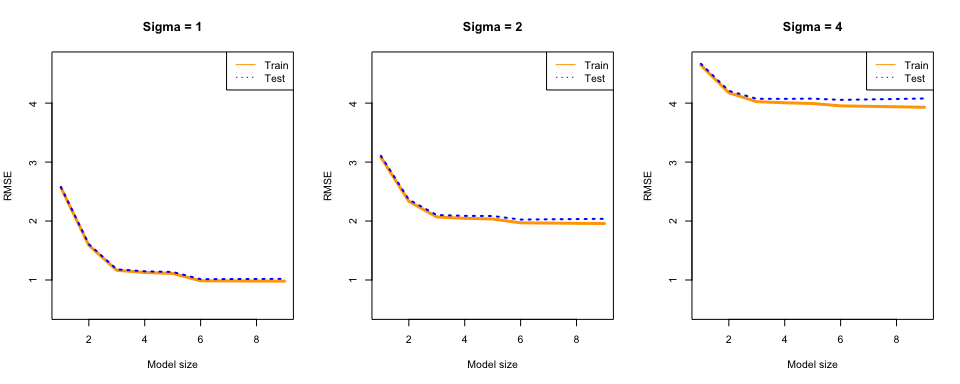<!-- -->


```r
# Print RMSE value for each sigma, train and test set
print_by_sigma()
```


| Model size| Sigma.1.Train| Sigma.1.Test| Sigma.2.Train| Sigma.2.Test| Sigma.4.Train| Sigma.4.Test|
|----------:|-------------:|------------:|-------------:|------------:|-------------:|------------:|
|          1|        2.5665|        2.578|         3.084|        3.107|         4.643|        4.667|
|          2|        1.5885|        1.608|         2.335|        2.364|         4.177|        4.208|
|          3|        1.1642|        1.180|         2.069|        2.102|         4.025|        4.074|
|          4|        1.1276|        1.147|         2.046|        2.088|         4.006|        4.073|
|          5|        1.1115|        1.137|         2.035|        2.085|         3.994|        4.076|
|          6|        0.9861|        1.014|         1.970|        2.025|         3.954|        4.055|
|          7|        0.9841|        1.016|         1.966|        2.030|         3.946|        4.063|
|          8|        0.9822|        1.018|         1.962|        2.034|         3.938|        4.071|
|          9|        0.9803|        1.020|         1.958|        2.038|         3.930|        4.079|

### Discussion

We will discuss whether the RMSE method **always** select the correct model.

- RMSE can be interpreted as the smaller the better.
- From the above 3 plots, we can see a considerably high RMSE value when model size is 1 and 2. It is a case of underfitting for both train and test set.

##### Train set RMSE performance

- RMSE value starts to diminish slowely after sitting at the model with size 3.
- Meanwhile, the test and train set RMSE start to diverge.
- Train set RMSE remains in a state of good performance and it is further improved at model with size 6. We don't see any issue of underfitting as train set RMSE converges to the minimum at model with size 9.

##### Test set RMSE performance

- RMSE value starts to diminish slowely after model with size 3, and even slower than Train set RMSE.
- Test RMSE set converges to minimum point at model with size 6. 
- However, it starts to rebound from model size 7 to 9. It is a case of overfitting.

```r
# Zoom in the plots to show the effect of divergence
plot_RMSE(show_diverge = TRUE, select_model = 6)
```

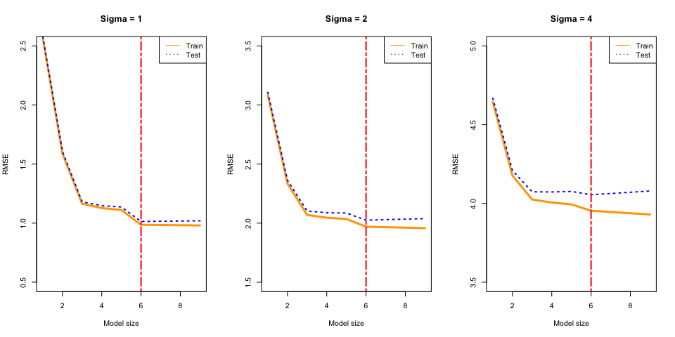<!-- -->

##### The correct model

- Hence, we conclude that model with size 6 is the correct model for explaining the dataset. Although train set RMSE is the lowest for model 9, test set RMSE is higher, which indicates the model does not work well with new data and suffers from overfitting.
- In the above plots, the red line indicates the correct model size.


```r
# No. of times a model is selected
print_model_selected()
```


|          |  1|  2|   3|   4|  5|   6|   7|   8|   9|
|:---------|--:|--:|---:|---:|--:|---:|---:|---:|---:|
|Sigma = 1 |  0|  0|   0|   0|  1| 528| 203| 122| 146|
|Sigma = 2 |  0|  0|  30|  12| 14| 524| 196| 110| 114|
|Sigma = 4 |  0| 23| 171| 107| 65| 316| 130|  85| 103|

##### Always being selected ?

- The model with size 6, is the most selected model for all 3 $\sigma$(s).
- But the portion of the selection is not ideal. The highest percentage rougly **54%** of $\sigma$ = 1. The lowest is only **34%** of $\sigma$ = 4.


```r
# Portion of the correct model selected
print_model_selected(portion = TRUE, correct_model = 6)
```


|          | Portion of the correct Model Selected|
|:---------|-------------------------------------:|
|Sigma = 1 |                                 0.528|
|Sigma = 2 |                                 0.524|
|Sigma = 4 |                                 0.316|

#### Does RMSE method always select the correct model ?
- The RMSE method **does not** always select the correct model. It is not a reliable method for model selection in current study.

##### Level of noise impact ?

We will discuss whether the level of noice would affect our selection result.


```r
# Re-plot for easy reference
plot_RMSE()
```

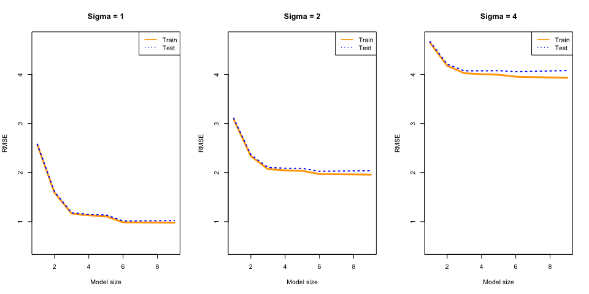<!-- -->

- RMSE
  - When $\sigma$ becomes larger, the average RMSE value becomes larger, but the variability of RMSE value becomes lower. There is a positive relationship between $\sigma$ and average RMSE value.
  - When $\sigma$ becomes larger, the performace of test set will start to decrease earlier. Test and train set will diverge more than that of smaller $\sigma$.


```r
# Re-plot for easy reference
print_model_selected()
```


|          |  1|  2|   3|   4|  5|   6|   7|   8|   9|
|:---------|--:|--:|---:|---:|--:|---:|---:|---:|---:|
|Sigma = 1 |  0|  0|   0|   0|  1| 528| 203| 122| 146|
|Sigma = 2 |  0|  0|  30|  12| 14| 524| 196| 110| 114|
|Sigma = 4 |  0| 23| 171| 107| 65| 316| 130|  85| 103|

```r
print_model_selected(portion = TRUE, correct_model = 6)
```


|          | Portion of the correct Model Selected|
|:---------|-------------------------------------:|
|Sigma = 1 |                                 0.528|
|Sigma = 2 |                                 0.524|
|Sigma = 4 |                                 0.316|

- Model selection
  - When $\sigma$ becomes larger, the selection becomes broader.
    - $\sigma$ = 1, 4 out of 9 models were selected
    - $\sigma$ = 2, 7 out of 9 models were selected
    - $\sigma$ = 4, 8 out of 9 models were selected

We can interpret as, with higher variance, there is higher probability other models will perform better, but generally over 1000 simulations, they perform poorly.

  - When $\sigma$ becomes larger, the lower chance the correct model is selected.

We can interpret that some other models would perform better due to high variance. Therefore, we prefer a lower $\sigma$ value during model selection process.

# Simulation Study 3: Power

### Introduction
In this simulation study we will investigate the **power** of the significance of regression test for simple linear regression. 

\[
H_0: \beta_{1} = 0 \ \text{vs} \ H_1: \beta_{1} \neq 0
\]

Recall, we had defined the *significance* level, $\alpha$, to be the probability of a Type I error.

\[
\alpha = P[\text{Reject } H_0 \mid H_0 \text{ True}] = P[\text{Type I Error}]
\]

Similarly, the probability of a Type II error is often denoted using $\beta$; however, this should not be confused with a regression parameter.

\[
\beta = P[\text{Fail to Reject } H_0 \mid H_1 \text{ True}] = P[\text{Type II Error}]
\]

*Power* is the probability of rejecting the null hypothesis when the null is not true, that is, the alternative is true and $\beta_{1}$ is non-zero.

\[
\text{Power} = 1 - \beta = P[\text{Reject } H_0 \mid H_1 \text{ True}]
\]

Essentially, power is the probability that a signal of a particular strength will be detected. Many things affect the power of a test. In this case, some of those are:

- Sample Size, $n$
- Signal Strength, $\beta_1$
- Noise Level, $\sigma$
- Significance Level, $\alpha$

We'll investigate the first three.

### Methods

For simplicity, we will let $\beta_0 = 0$, thus $\beta_1$ is essentially controlling the amount of "signal." We will then consider different signals, noises, and sample sizes:

- $\beta_1 \in (-2, -1.9, -1.8, \ldots, -0.1, 0, 0.1, 0.2, 0.3, \ldots 1.9, 2)$
- $\sigma \in (1, 2, 4)$
- $n \in (10, 20, 30)$

We will hold the significance level constant at $\alpha = 0.05$.


```r
# Seed
set.seed(birthday)
```


```r
# Global Parameter
beta_1 = seq(-2, 2, 0.1)
sigma = c(1, 2, 4)
n = c(10, 20, 30)

beta_0 = 0
alpha = 0.05

sim_cycle = 1000
```


```r
power = matrix(0, length(beta_1), length(sigma)) # power for each sigma
power_n = data.frame(n10 = power, n20 = power, n30 = power) # power for all n
```

We will simulate from the model

\[
Y_i = \beta_0 + \beta_1 x_i + \epsilon_i
\]

where $\epsilon_i \sim N(0, \sigma^2)$.


```r
# simulate data
sim_slr = function(x, beta_1, sigma, beta_0 = 0){
  n = length(x)
  epsilon = rnorm(n, mean = 0, sd = sigma)
  Y = beta_0 + beta_1 * x + epsilon
  data.frame(y = Y, x = x)
}
```

For each possible $\beta_1$ and $\sigma$ combination, simulate from the true model at least $1000$ times. Each time, perform the significance of the regression test.

The following sample code is the method to generate the predictor values, `x`: values for different sample sizes.


```r
x_values = seq(0, 5, length = n)
```


```r
# estimate power by different sample sizes
Estimate_power = function(size = 10){
  
  x = seq(0, 5, length = size) # generate x by the sample size
  
  for (i in 1:length(sigma)) {  #sigma
    for (j in 1:length(beta_1)) { #beta_1
      cnt_rej = 0 
      for (k in 1:sim_cycle) { #sim_cycle = 1000
        sim_data = sim_slr(x, beta_1[j], sigma[i])
        ml = lm(y ~ x, sim_data)
        p_value = summary(ml)$coef['x', 'Pr(>|t|)'] # retrieve p-value
        if (p_value < alpha) {
          cnt_rej = cnt_rej + 1 #count no. of rejection
        }
      }
      power[j, i] <<- cnt_rej
      cnt_rej = 0 #reset count after simulation cycle
    } #beta_1
  } #sigma
  
  if (size == n[1]) { 
    power_n[, 1:3] <<- power
  } else if (size == n[2]) {
    power_n[, 4:6] <<- power
  } else if (size == n[3]) {
    power_n[, 7:9] <<- power
  }
}
```

In the functions below, before plotting the result, we will calculate the estimate of Power by this formula,

\[
\hat{\text{Power}} = \hat{P}[\text{Reject } H_0 \mid H_1 \text{ True}] = \frac{\text{# Tests Rejected}}{\text{# Simulations}}
\]


```r
# initialize variables
initialize_var = function(cycle){
  sim_cycle <<- cycle
  power <<- matrix(0, length(beta_1), length(sigma))
  power_n <<- data.frame(n10 = power, n20 = power, n30 = power) # variable for all n(s)
}

# plot power for each sigma, with different n 
plot_power = function(Power_n, plot1 = FALSE, plot2 = FALSE, plot3 = FALSE){
  
  tmp_power = Power_n / sim_cycle #calculate estimate of Power
  tmp_power = cbind(beta_1, tmp_power) #add beta_1 value
  
  if (plot1 == TRUE){
    plot(n10.1 ~ beta_1, tmp_power, lty = 3,
         pch = 1, lwd = 2, col = 'darkorange', ylab = 'Power', xlab = expression(beta[1]),
         main = expression('Strength of Power vs ' ~ beta[1] ~ ' | ' ~ sigma ~ ' = 1'))
    lines(n20.1 ~ beta_1, tmp_power, col = 'blue', lty = 2, lwd = 2)
    lines(n30.1 ~ beta_1, tmp_power, col = 'darkgreen', lty = 1, lwd = 2)
    legend('bottomright', pch = c(1, NA, NA), lty = c(NA, 2, 1),  lwd = c(2, 2, 2),
           col = c('darkorange', 'blue', 'darkgreen'),
           c('n = 10', 'n = 20', 'n = 30'))
  }
  
  if (plot2 == TRUE){
    plot(n10.2 ~ beta_1, tmp_power,
         pch = 1, lwd = 2, col = 'darkorange', ylab = 'Power', xlab = expression(beta[1]),
         main = expression('Strength of Power vs ' ~ beta[1] ~ ' | ' ~ sigma ~ ' = 2'),
         ylim = c(0, 1))
    lines(n20.2 ~ beta_1, tmp_power, col = 'blue', lty = 2, lwd = 2)
    lines(n30.2 ~ beta_1, tmp_power, col = 'darkgreen', lty = 1, lwd = 2)
    legend('bottomright', pch = c(1, NA, NA), lty = c(NA, 2, 1),  lwd = c(2, 2, 2),
           col = c('darkorange', 'blue', 'darkgreen'),
           c('n = 10', 'n = 20', 'n = 30'))
  }
  
  if (plot3 == TRUE){
    plot(n10.3 ~ beta_1, tmp_power,
         pch = 1, lwd = 2, col = 'darkorange', ylab = 'Power', xlab = expression(beta[1]),
         main = expression('Strength of Power vs ' ~ beta[1] ~ ' | ' ~ sigma ~ ' = 4'),
         ylim = c(0, 1))
    lines(n20.3 ~ beta_1, tmp_power, col = 'blue', lty = 2, lwd = 2)
    lines(n30.3 ~ beta_1, tmp_power, col = 'darkgreen', lty = 1, lwd = 2)
    legend('bottomright', pch = c(1, NA, NA), lty = c(NA, 2, 1), lwd = c(2, 2, 2),
           col = c('darkorange', 'blue', 'darkgreen'),
           c('n = 10', 'n = 20', 'n = 30'))
  }
}

# print average power per sigma
effect_sigma_avg = function(Power_n){
  tmp_power = Power_n / sim_cycle
  df = data.frame(
    'Sample size' = c(10, 20, 30),
    'Sigma 4' = c(mean(tmp_power[, 3]),
                  mean(tmp_power[, 6]),
                  mean(tmp_power[, 9])),
    'Sigma 2' = c(mean(tmp_power[, 2]),
                  mean(tmp_power[, 5]),
                  mean(tmp_power[, 8])),
    'Sigma 1' = c(mean(tmp_power[, 1]),
                  mean(tmp_power[, 4]),
                  mean(tmp_power[, 7]))
  )
  kable(df, "markdown")
}

# print portion of power > 0.95
effect_sigma_95 = function(Power_n){
  tmp_power = Power_n / sim_cycle
  df2 = data.frame(
    'Sample size' = c(10, 20, 30),
    'Sigma 4' = c(mean(tmp_power[, 3] > 0.95),
                  mean(tmp_power[, 6] > 0.95),
                  mean(tmp_power[, 9] > 0.95)),
    'Sigma 2' = c(mean(tmp_power[, 2] > 0.95),
                  mean(tmp_power[, 5] > 0.95),
                  mean(tmp_power[, 8] > 0.95)),
    'Sigma 1' = c(mean(tmp_power[, 1] > 0.95),
                  mean(tmp_power[, 4] > 0.95),
                  mean(tmp_power[, 7] > 0.95)))
  kable(df2, "markdown")
}

# plot distribution of power of each sigma and sample size
effect_sigma_hist = function(Power_n){
  
  tmp_power = Power_n / sim_cycle
  
  par(mfrow = c(3, 3))
  # n = 10
  hist(tmp_power[, 1], breaks = 10, freq = TRUE, ylim = c(0, 30),
       xlim = c(0, 1), xlab = 'n = 10', col = 'orange', border = 'brown',
       main = 'Power @ Sigma = 1') #sigma1
  hist(tmp_power[, 2], breaks = 10, freq = TRUE, ylim = c(0, 30),
       xlim = c(0, 1), xlab = 'n = 10', col = 'orange', border = 'brown',
       main = 'Power @ Sigma = 2', ylab = '') #sigma2
  hist(tmp_power[, 3], breaks = 8, freq = TRUE, ylim = c(0, 30),
       xlim = c(0, 1), xlab = 'n = 10', col = 'orange', border = 'brown',
       main = 'Power @ Sigma = 4', ylab = '') #sigma3
  
  hist(tmp_power[, 4], breaks = 10, freq = TRUE, ylim = c(0, 35),
       xlim = c(0, 1), main = '', xlab = 'n = 20',
       col='orange', border='brown') #sigma1
  hist(tmp_power[, 5], breaks = 10, freq = TRUE, ylim = c(0, 35),
       xlim = c(0, 1), main = '', xlab = 'n = 20',
       col = 'orange', border = 'brown', ylab = '') #sigma2
  hist(tmp_power[, 6], breaks = 8, freq = TRUE, ylim = c(0, 35), 
       xlim = c(0, 1), main = '', xlab = 'n = 20',
       col = 'orange', border = 'brown', ylab = '') #sigma3
  
  hist(tmp_power[, 7], breaks = 10, freq = TRUE, ylim = c(0, 35),
       xlim = c(0, 1), xlab = 'n = 30', main = '',
       col = 'orange', border = 'brown') #sigma1
  hist(tmp_power[, 8], breaks = 10, freq = TRUE, ylim = c(0, 35),
       xlim = c(0, 1), xlab = 'n = 30', main = '',
       col = 'orange', border = 'brown', ylab = '') #sigma2
  hist(tmp_power[, 9], breaks = 8, freq = TRUE, ylim = c(0, 35), 
       xlim = c(0, 1), xlab = 'n = 30', main = '',
       col = 'orange', border = 'brown', ylab = '') #sigma3
}

# print average power per sample size, beta_1
effect_sample = function(Power_n, from, to){
  tmp_power = Power_n / sim_cycle
  power_size = cbind(beta_1, cbind(tmp_power$n10.2, tmp_power$n20.2, tmp_power$n30.2))
  colnames(power_size) = c('beta_1', 'n = 10', 'n = 20', 'n = 30')
  
  kable(power_size[from:to, ], "markdown") 
}

# Plot effect of beta vs Power
effect_beta = function(Power_n){  
  tmp_power = Power_n / sim_cycle
  tmp_power = cbind(beta_1, tmp_power)
  plot(n30.1 ~ abs(beta_1), tmp_power, col = 'blue',
       main = expression('Strength of Power vs ' ~ beta[1]),
       pch = 1, xlab = expression(beta[1]), ylab = 'Power')
  points(n30.2 ~ abs(beta_1), tmp_power, col = 'orange')
  points(n30.3 ~ abs(beta_1), tmp_power, col = 'red')
  legend('bottomright', c('sigma = 1', 'sigma = 2', 'sigma = 4'),
         col = c('blue', 'orange', 'red'), pch = 1)
}

# Boxplot effect of sigma vs power
effec_sigma_plot = function(Power_n){
  
  tmp_power = Power_n / sim_cycle
  tmp_power = cbind(beta_1, tmp_power)
  s1 = c(tmp_power$n10.1, tmp_power$n20.1, tmp_power$n30.1)
  s2 = c(tmp_power$n10.2, tmp_power$n20.2, tmp_power$n30.2)
  s3 = c(tmp_power$n10.3, tmp_power$n20.3, tmp_power$n30.3)
  
  tmp_power2 = cbind(s1, s2, s3)
  colnames(tmp_power2) = c(1, 2, 4)
  boxplot(tmp_power2, col = 'orange', xlab = 'Power',
          main = expression('Strength of Power vs ' ~ sigma),
          ylab = c(expression(sigma)), border = 'brown', horizontal = TRUE)
}

# Boxplot effect of samplesize vs power
effect_sample_plot = function(Power_n){
  
  tmp_power = Power_n / sim_cycle
  tmp_power = cbind(beta_1, tmp_power)
  n10 = c(tmp_power$n10.1, tmp_power$n10.2, tmp_power$n10.3)
  n20 = c(tmp_power$n20.1, tmp_power$n20.2, tmp_power$n20.3)
  n30 = c(tmp_power$n30.1, tmp_power$n20.2, tmp_power$n30.3)
  
  tmp_power2 = cbind(n10, n20, n30)
  colnames(tmp_power2) = c(10, 20, 30)
  boxplot(tmp_power2, col = 'cadetblue2', xlab = 'Power',
          main = expression('Strength of Power vs Sample size'),
          ylab = 'Sample Size', border = 'brown', horizontal = TRUE
  )
}
```

### Results

```r
initialize_var(sim_cycle) #set no. of simulation cycle 1000
Estimate_power(n[1]) # n = 10
Estimate_power(n[2]) # n = 20
Estimate_power(n[3]) # n = 30
```


```r
plot_power(power_n, TRUE, TRUE, TRUE)
```

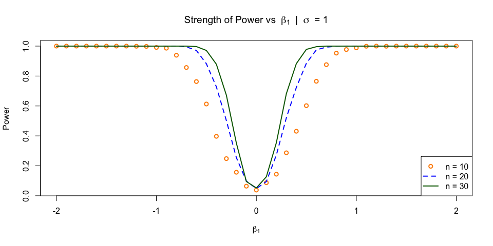<!-- -->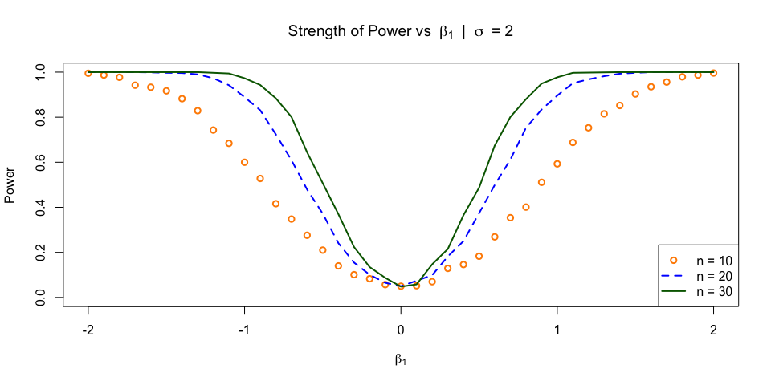<!-- -->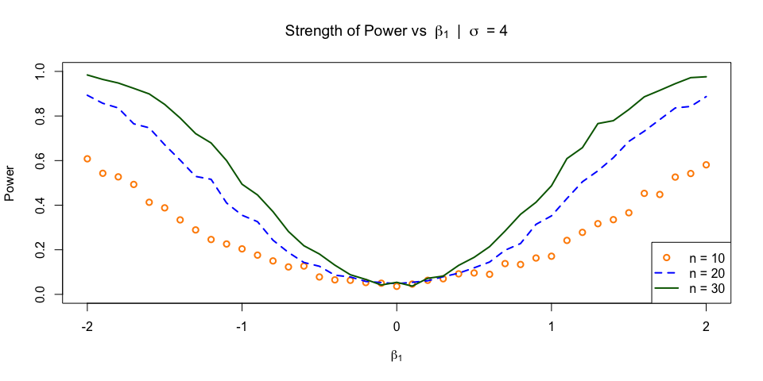<!-- -->

### Discussion

- How do $n$, $\beta_1$, and $\sigma$ affect power? Consider additional plots to demonstrate these effects.

##### Effect of Sigma
  - When sigma becomes smaller, the average strength of Power is higher.

```r
effect_sigma_avg(power_n) #Average power
```


| Sample.size| Sigma.4| Sigma.2| Sigma.1|
|-----------:|-------:|-------:|-------:|
|          10|  0.2523|  0.5676|  0.7843|
|          20|  0.4157|  0.7043|  0.8523|
|          30|  0.5199|  0.7599|  0.8790|
  
- When sigma becomes smaller, the portion of Power > 0.95 becomes higher. When sigma = 1 and n = 30, there are 78% of the simulations would be very likely to reject $H_0$.
- When sigma is large and beta_1 becomes closer to zero, the power starts to decrease earlier than that with smaller sigma. We can observe the trend from the above plots.
- When sigma becomes larger, the maximom rejection number becomes lower, and the power starts to deterioate earlier when beta_1 is closer to zero.
  

```r
# Portion of Power > 0.95
effect_sigma_95(power_n)
```


| Sample.size| Sigma.4| Sigma.2| Sigma.1|
|-----------:|-------:|-------:|-------:|
|          10|  0.0000|  0.1707|  0.6098|
|          20|  0.0000|  0.4634|  0.7317|
|          30|  0.0976|  0.5366|  0.7805|


```r
# Plot the effect of sigma vs Power
effec_sigma_plot(power_n)
```

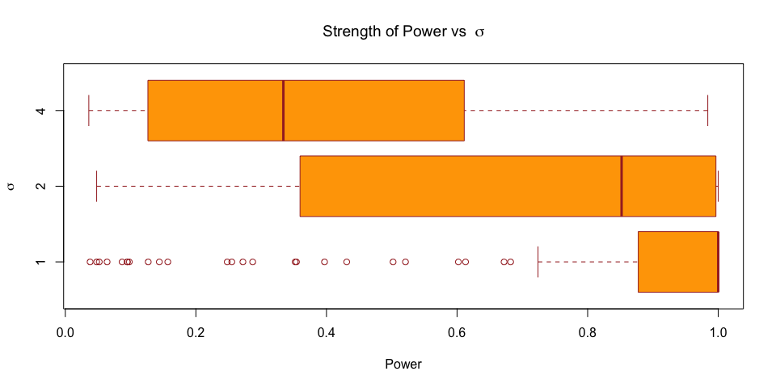<!-- -->

The histograms below are combination of sigma and sample size. They show similar findings as discussed above.

```r
# Plot distribution of Power of each sigma and n
effect_sigma_hist(power_n)
```

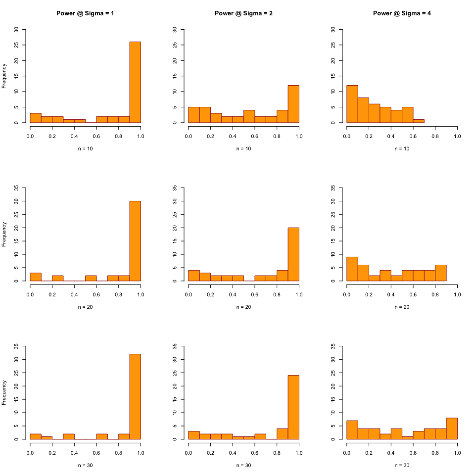<!-- -->

- When sigma is small and n is large, the Power is particularly strong when $|\beta_1|$ is between 0.5 and 2.


```r
# Re-plot for easy reference
par(mfrow=c(1,1))
plot_power(power_n, plot1 = TRUE) #Sigma = 1
```

<!-- -->


#### Effect of sample size n

```r
effect_sample_plot(power_n) # Plot the effect of Sample size n
```

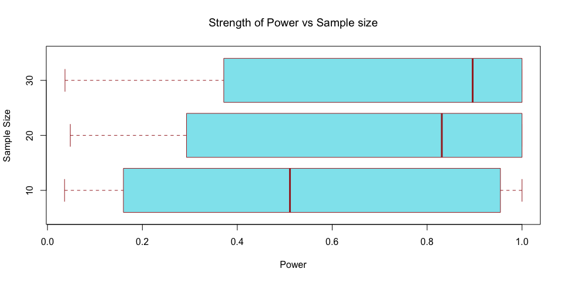<!-- -->

- When n becames larger, the average stength of power is higher. The improvement is more obvious when for sigma equals to 2 or 4.

```r
effect_sigma_avg(power_n) # Print average power per sample size, sigma
```


| Sample.size| Sigma.4| Sigma.2| Sigma.1|
|-----------:|-------:|-------:|-------:|
|          10|  0.2523|  0.5676|  0.7843|
|          20|  0.4157|  0.7043|  0.8523|
|          30|  0.5199|  0.7599|  0.8790|
    
- When n becomes smaller with a larger sigma, say sigma = 4, it is very unlikely to reject $H_0$.
- However, when n = 30, with larger sigma, say sigma = 4, it is possible to reject $H_0$, but chance is very low.
- When n becomes larger, with smaller sigma, both average power and chance to reject $H_0$ increase significantly.

```r
effect_sigma_95(power_n) # Print portion of power > 95% per sample size, sigma
```


| Sample.size| Sigma.4| Sigma.2| Sigma.1|
|-----------:|-------:|-------:|-------:|
|          10|  0.0000|  0.1707|  0.6098|
|          20|  0.0000|  0.4634|  0.7317|
|          30|  0.0976|  0.5366|  0.7805|


```r
par(mfrow=c(3,1))

# Visualize the effect of sample size vs power decrease 
plot_power(power_n, plot1 = TRUE)
plot_power(power_n, plot2 = TRUE)
plot_power(power_n, plot3 = TRUE)
```

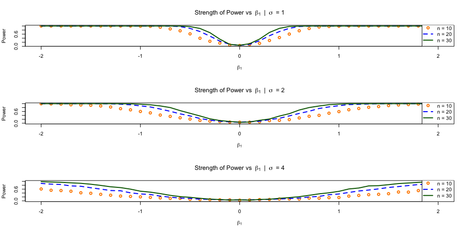<!-- -->

- There is a relationship between the sample size and the moment power starts to decrease.
- The smaller the value of n, the earlier the power starts to decrease.
- When n is larger, say $n = 30$, $\sigma = 2$, power will hold at 1 from $-2 < \beta_1 < -1.3$ before it starts to decrease.
- When n is smaller, say $n = 20$, power starts to decrease when $\beta_1 = -1.1$. When $n = 10$, it starts even earlier.
- We can see the trend from both the above 3 plots, and the table below.


```r
effect_sample(power_n, 1, 15) #print the first 15 rows where power starts to decrease in each n
```


| beta_1| n = 10| n = 20| n = 30|
|------:|------:|------:|------:|
|   -2.0|  0.995|  1.000|  1.000|
|   -1.9|  0.987|  1.000|  1.000|
|   -1.8|  0.977|  1.000|  1.000|
|   -1.7|  0.942|  1.000|  1.000|
|   -1.6|  0.933|  0.999|  1.000|
|   -1.5|  0.917|  0.997|  1.000|
|   -1.4|  0.882|  0.996|  1.000|
|   -1.3|  0.829|  0.990|  1.000|
|   -1.2|  0.743|  0.973|  0.997|
|   -1.1|  0.684|  0.942|  0.994|
|   -1.0|  0.600|  0.889|  0.973|
|   -0.9|  0.528|  0.831|  0.943|
|   -0.8|  0.416|  0.724|  0.884|
|   -0.7|  0.348|  0.609|  0.801|
|   -0.6|  0.276|  0.479|  0.644|

- When $\sigma$ is smaller, the power increases quickly when $\beta_1$ becomes larger.

#### Effect of $\beta_1$

- When the absolute value of Beta_1 comes close to zero, the Power decrases, and could be critically close to zero for all n. The trend can be seen in the above 3 plots.
- The relationship forms a symmetric, inverted-bell shape. The actual numbers associated with $\sigma = 2$, are in the below table


```r
effect_sample(power_n, 14, 29) #print row 14 to 29, where Beta_1 is close to zero
```


| beta_1| n = 10| n = 20| n = 30|
|------:|------:|------:|------:|
|   -0.7|  0.348|  0.609|  0.801|
|   -0.6|  0.276|  0.479|  0.644|
|   -0.5|  0.210|  0.372|  0.507|
|   -0.4|  0.140|  0.241|  0.370|
|   -0.3|  0.101|  0.155|  0.224|
|   -0.2|  0.083|  0.101|  0.135|
|   -0.1|  0.057|  0.065|  0.087|
|    0.0|  0.050|  0.050|  0.048|
|    0.1|  0.052|  0.074|  0.058|
|    0.2|  0.070|  0.099|  0.147|
|    0.3|  0.129|  0.182|  0.215|
|    0.4|  0.146|  0.250|  0.365|
|    0.5|  0.183|  0.374|  0.487|
|    0.6|  0.269|  0.499|  0.674|
|    0.7|  0.354|  0.612|  0.801|
|    0.8|  0.401|  0.753|  0.880|

- The absoule value of the signal strength, $|\beta_1|$, is very likely to have a positive relatinoship with the strength of power.

```r
effect_beta(power_n) #plot effect of Beta_1 vs power, for each sigma  
```

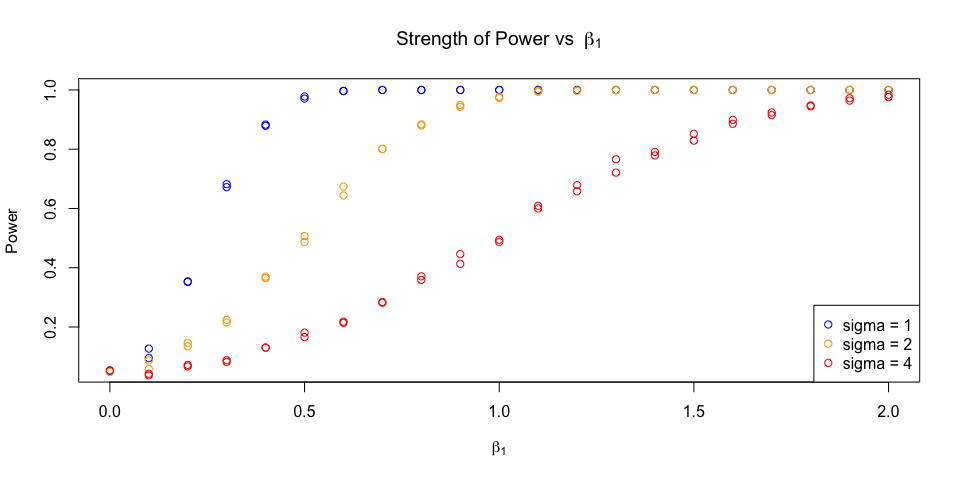<!-- -->

##### Are $1000$ simulations sufficient?
  - $1000$ simulations is sufficient to visulaize the trend between the 3 items and the strength of power with current parameter values. However, more simulations would further smooth out the curve. 
  - More simulations will be necessary when $\sigma$ value is sufficiently larger than current setting.
  
